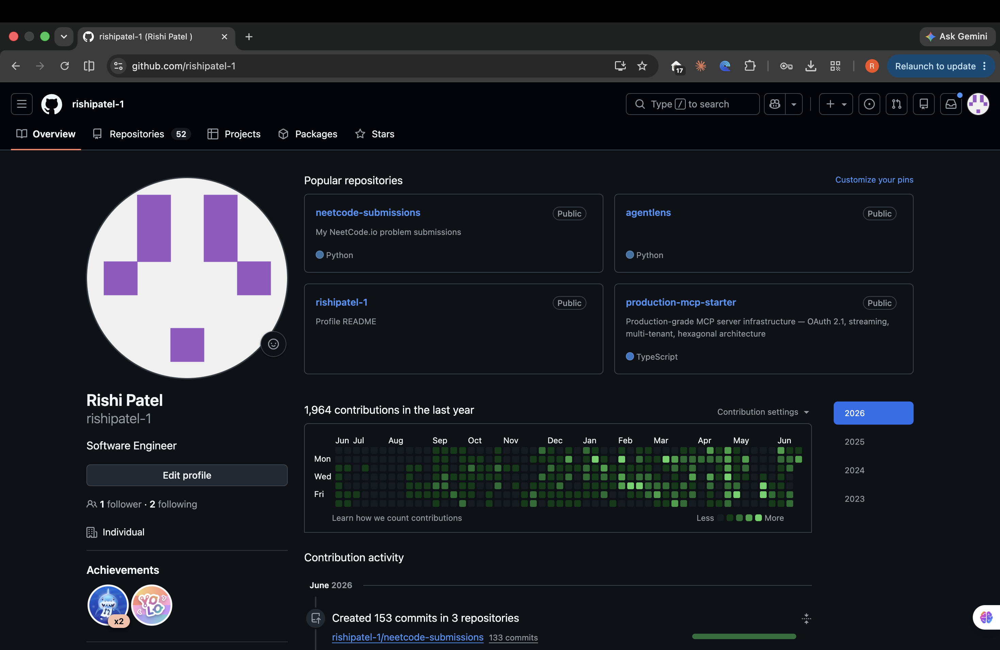

# Hi, I'm Rishi

Software engineer who builds agentic AI systems and ships them to production. I like working on problems where LLMs meet real infrastructure — orchestration, retrieval, evaluation, security, and making things actually reliable at scale.

## What I'm building

### AgentLens
A platform where AI agents answer questions over your documents using retrieval — and every step they take is traced, evaluated, and searchable. Not a wrapper around an API. The whole pipeline from scratch:
- RAG with chunking, embeddings, pgvector search, and recall@k scoring to measure if retrieval is actually good
- Agent layer with tool calling, multi-step reasoning, and grounded citations
- LLM-as-judge evaluation — the system scores its own outputs so I know if a change made things better or worse
- Failure intelligence — past agent failures get embedded and become searchable (RAG on ops data)
- Distributed job queue on Postgres SKIP LOCKED with retries and DLQ
- 49 tests. TDD throughout. Built to be explainable end-to-end.

`Python` `FastAPI` `pgvector` `PostgreSQL` `Google Gemini` `Next.js` `Docker`

### Production MCP Starter
Infrastructure that lets AI agents securely call external tools at scale. The kind of plumbing most people skip:
- Streamable HTTP transport (JSON-RPC + SSE) — agents get streaming responses
- OAuth 2.1 + PKCE with Redis-backed single-use state
- AES-256-GCM token vault — encrypted at rest, per-record IV, tamper detection tests
- Per-user rate limiting, idempotency cache, circuit breakers
- Hexagonal architecture enforced by linter — domain never touches infra
- Multi-stage Docker, Cloudflare Workers as edge runtime

`TypeScript` `Hono` `PostgreSQL` `Redis` `Docker` `Cloudflare Workers`

## Stack

Python, TypeScript, FastAPI, Node.js, NestJS, React, Next.js, PostgreSQL, pgvector, Redis, LangGraph, LangChain, AWS (Lambda, SQS, Kafka, DynamoDB), Docker, Kubernetes

## What's in private repos

The public repos are the indie builds. The private ones are production systems I've designed, built, and shipped:

- **Multi-agent AI orchestration** — 6-agent LangGraph workflow with conditional routing, state persistence, quality scoring, and multi-model LLM fallbacks. Live in production serving real users. Perceived latency went from 60s to 10s through streaming and parallel execution.
- **Event-driven backends at scale** — Kafka + SQS + Lambda + DynamoDB handling 500K+ concurrent users with 35% downtime reduction. Designed for fault tolerance — circuit breakers, exponential backoff, graceful degradation.
- **Real-time streaming infrastructure** — Electron + React desktop app coordinating 14+ internal services over WebSocket, RTMP, and FFmpeg pipelines. Central state machine with heartbeat monitoring and automatic recovery.
- **Full-stack product delivery** — 10+ production applications shipped with React/Next.js frontends, NestJS/Express backends, PostgreSQL/MongoDB datastores. Payment integrations (Stripe, PayPal), CI/CD on AWS, Docker deployments.
- **Cloud infrastructure & DevOps** — AWS (Lambda, EC2, S3, SQS, Kafka, DynamoDB, ElastiCache, CloudFormation), Docker multi-stage builds, Kubernetes deployments, GitHub Actions / GitLab CI/CD pipelines, infrastructure as code.

The green squares are real. 1,900+ contributions in the last year across all of this.

## Links

- Email: patelris2001@gmail.com
